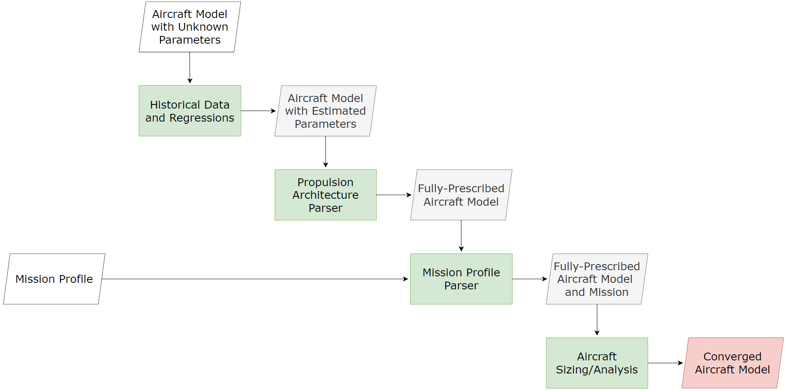

---

title: 'FAST: A **F**uture **A**ircraft **S**izing **T**ool for Conventional and Electrified Aircraft Design'

tags:
  - Matlab
  - Sustainable Aviation
  - Electrified Aircraft
  - Electrification
  - Conceptual Aircraft Design

authors:
  - name: Paul R. Mokotoff
    orcid: 0009-0006-4651-5597
    corresponding: true
    affiliation: 1

  - name: Maxfield Arnson
    affiliation: 1
  
  - name: Gokcin Cinar
    orcid: 0000-0002-2562-0332
    affiliation: 1

affiliations:

 - name: Department of Aerospace Engineering, University of Michigan
   index: 1

date: 01 August 2024

bibliography: paper.bib

---

<!--------------------------------------------------------->
<!--------------------------------------------------------->
<!--------------------------------------------------------->

<!----------------------------
|                            |
| LINK TO THE JOSS REVIEW    |
| CRITERIA AND GUIDELINES:   |
|                            |
----------------------------->

[Link to the JOSS Review Criteria and Guidelines](https://joss.readthedocs.io/en/latest/paper.html)

<!--------------------------------------------------------->
<!--------------------------------------------------------->
<!--------------------------------------------------------->

<!----------------------------
|                            |
| SUMMARY                    |
|                            |
----------------------------->

# Summary

Atmospheric emissions from the aviation industry have contributed to approximately 3.5% of all anthropogenic climate impact [@lee2021contribution].
Innovative electrified and novel aircraft designs are being developed to combat the adverse environmental impacts of flying and minimize the industry's CO~2~ emissions.
For example, the United States' National Aeronautics and Space Adminstation (NASA) has begun to develop and test electrified aircraft designs within its Electrified Powertrain Flight Demonstration (EPFD) Project [@nasa2022epfd].
NASA's EPFD and hybrid-electric research teams need an aircraft sizing tool that can rapidly assess the performance of these new electrified aircraft designs.
However, existing aircraft sizing tools require the engineer to know information about the design a priori, which may not be available at the start of a new project, particularly for these novel aircraft designs.
As a result of this, the engineer is forced to make uninformed design decisions, which yields suboptimal aircraft designs and inhibits further innovation.
Based on these needs, a computational tool must be developed to rapdily size an aircraft configuration and allow the designer to explore the vast design space, examine tradeoffs, and evaluate alternative designs.

The **F**uture **A**ircraft **S**izing **T**ool, **FAST**, is a rapid aircraft sizing tool specifically designed for early-phase conventional and electrified aircraft design applications and is capable of sizing an aircraft with *any* propulsion architecture.
In addition to returning a sized aircraft, FAST can also provide visualizations of the sized aircraft (using pre-packaged or user-specified geometry configurations) as well as plots of the aircraft and propulsion system's performance as a function of time.
This helps the engineer evaluate alternative aircraft configurations and make more informed design decisions.
FAST aids in the early-phase aircraft design and development process, particularly as novel aircraft concepts are needed to minimize aviation's CO~2~ emissions and combat its harmful contributions to climate change.

<!--------------------------------------------------------->
<!--------------------------------------------------------->
<!--------------------------------------------------------->

<!----------------------------
|                            |
| STATEMENT OF NEED          |
|                            |
----------------------------->

# Statement of Need

Previously developed computational tools for conceptual aircraft design focus on late-phase conceptual design [@cinar2018methodology], which requires the engineer to know information about their design (or have made design decisions already).
As a result of the detailed analyses that these tools run, the time to converge on a design can be multiple minutes, which prevents the engineer from rapidly exploring the design space and comparing different aircraft configurations.
FAST overcomes these two downfalls.
First, FAST leverages historical data from over 450 previously flown aircraft and 200 aircraft engines to create regressions that predict any parameters that the user does not know about the design [@arnson2025predicting].
The regressions are also used during sizing to estimate the weight of the aircraft's engines based on the thrust/power they must provide.
Secondly, FAST combines the regressions with physics-based models to quickly analyze the aircraft configuration at-hand and converge on a design in less than one minute (usually less than 30 seconds).
This involves approximating the aircraft as a point mass and performing an energy-based mission analysis [@anderson1999aircraft; @cinar2018methodology] to determine the fuel, battery, etc. that must be carried to fly the prescribed mission.
FAST can also analyze an aircraft with *any* propulsion architecture, and is achieved by using a graph theory-inspired approach and representing the propulsion architecture connections and in-flight operations as matrices [@cinar2020framework].

FAST is being used in multiple research projects for assessing an electrified aircraft's performance.
First, the work by @mokotoff2025fast uses FAST to perform trade studies on an electrified LM100J, a freighter aircraft requested by NASA's EPFD team.
To electrify the LM100J, the outboard propulsors were powered by electric motors instead of gas-turbine engines.
An example of the propulsion architecture is shown in Fig. \autoref{Fig:LM100J-PropArch}.
The trade studies explored the fuel burn savings achieved by removing a fraction of the LM100J's payload to accommodate the battery required to power the electric motors.

{width = 80%}

Second, work by @wang2025subsonic explores modeling NASA's **SU**bsonic **S**ingle **A**ft E**n**gine (SUSAN) concept and explores how advanced technologies impact the aircraft's performance.
In addition to modeling SUSAN, more granular aerodynamic and propulsive models are being incorporated into FAST to better assess the benefits of boundary layer ingestion and distributed electric propulsion technologies.
Lastly, FAST was also used for a feasibility study in @deng2023sizing, which sized a fleet of hybrid electric aircraft and operated them on routes currently flown by regional jets.
This work served as a proof-of-concept for understanding how hybrid electric aircraft can be seamlessly integrated into a regional airline's fleet while maintaining the same operational capabilities as existing aircraft powered by gas-turbine engines.

<!--------------------------------------------------------->
<!--------------------------------------------------------->
<!--------------------------------------------------------->

<!----------------------------
|                            |
| FAST WORKFLOW              |
|                            |
----------------------------->

# FAST Workflow Overview

A high-level overview of FAST is illustrated in Fig. \autoref{Fig:HighLevelDSM}.
The user provided inputs, outputs, and FAST processes are shown by the white, red, and green boxes, respectively.

{width = 80%}

The user first provides all of the information known about the aircraft, which is assembled into an aircraft model.
Additionally, the user must provide a mission profile, which informs FAST how to fly the aircraft while sizing it.
Once this is information is given and the aircraft model is generated, FAST uses its built-in historical databases (developed in [@arnson2025predicting]) to create regressions and predict any unknown parameters that the user did not prescribe.
After all information about the aircraft is known, FAST generates mathematical representations of the aircraft's propulsion architecture (adapted from @cinar2020framework), which is used while flying the aircraft.
Before analyzing the aircraft, FAST checks to ensure that the mission profile provided by the user is valid.
Upon passing these checks, the aircraft is sized using a fixed-point iteration [@ascher2011first] to converge on a design.
To fly the design mission profile, an energy-based mission analysis [@anderson1999aircraft; @cinar2018methodology] is employed.
After the aircraft is sized, it is returned to the user as a Matlab `struct` for the user to either inspect or use in additional studies.
Further post-processing such as viewing the mission history (information about the flight simulated) or visualizing a geometric representation of the sized aircraft is also available.
An example of the mission history is plotted in Fig. \autoref{Fig:MissionHistory}.

{width = 80%}

An example of an aircraft geometry visualized in FAST is provided in Fig. \autoref{Fig:GeometryExample}.
The visualization capability was developed by @khailany2025aircraft and allows users to either prescribe their own aircraft geometry or use one that is shipped with FAST.

{width = 80%}

<!--------------------------------------------------------->
<!--------------------------------------------------------->
<!--------------------------------------------------------->

<!----------------------------
|                            |
| ACKNOWLEDGEMENTS           |
|                            |
----------------------------->

# Acknowledgements

This work is sponsored by the NASA Aeronautics Research Mission Directorate and the Electrified Powertrain Flight Demonstration (EPFD) project, "Development of a Parametrically Driven Electrified Aircraft Design and Optimization Tool".
The IDEAS Lab would like to thank Ralph Jansen, Andrew Meade, Karin Bozak, Amy Chicatelli, Noah Listgarten, Dennis Rohn, and Gaudy Bezos-O'Connor from the NASA EPFD project for supporting this work and providing valuable technical input and feedback throughout the duration of the project.
The work was performed under Glenn Engineering and Research Support Contract (GEARS) Contract No. 80GRC020D0003.

The authors would also like to thank Huseyin Acar, Nawa Khailany, Janki Patel, and Michael Tsai for their contributions to developing FAST.

<!--------------------------------------------------------->
<!--------------------------------------------------------->
<!--------------------------------------------------------->

<!----------------------------
|                            |
| REFERENCES                 |
| (included automatically)   |
|                            |
----------------------------->

# References